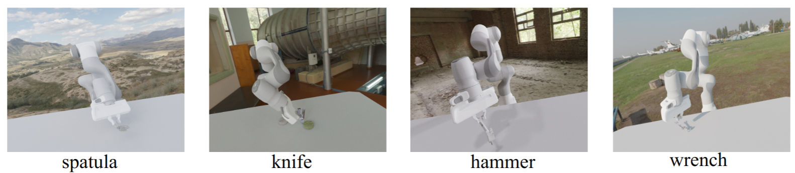
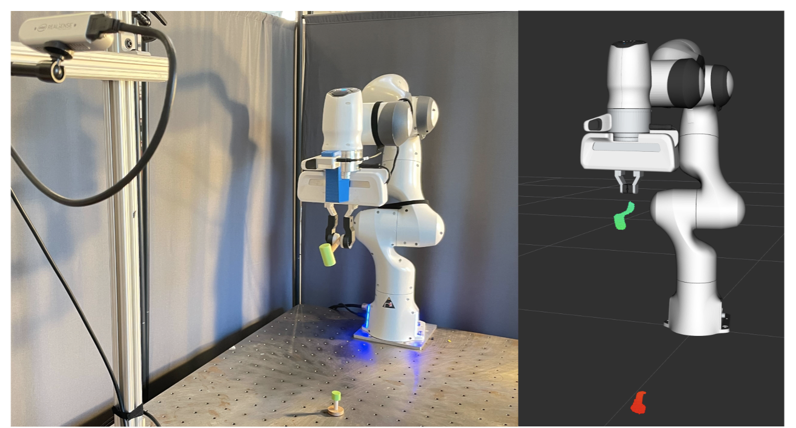

# Fleet-Tools

[Arxiv](https://arxiv.org/abs/2310.01362)  [Website](https://liruiw.github.io/fleet/) 

This repo is the simulation environment benchmark built with Gym API and Drake simulations for Franka Panda. The repository features tool-use tasks with scripted experts.




## ⚙️ Installation
1. ```pip install -r requirements```

## 🚶 Starting Commands
0. These commands will use the hand-scripted joint-space kpam planner to plan for demonstration trajectories 
1. Run ```bash experiments/running_scripts/frankahammer_tool_datacollection_test.sh```. open `local_host:6006`
2. Run `bash experiments/running_scripts/**_datacollection.sh` to generate the data. And export to the global python path such that the training repo `fleet_diffusion` can import it and run evaluation.

## 🚶 Simulation Teleop Demonstrations
0. Run ```python -m core.run run_expert=True teleop=True teleop_type=keyboard expert=HumanExpert task=FrankaDrakeSpatulaEnv task.use_meshcat=True```. open `local_host:6006` to use keyboard `wsad` to teleop.
1. If you want to try Oculus Quest >=2. Run:
`python -m core.run run_expert=True teleop=True teleop_type=vr expert=HumanExpert task=FrankaDrakeSpatulaEnv task.use_meshcat=True`
Hold the trigger for moving.

## 💾 File Structure
```angular2html
├── ...
├── Fleet-Tools
|   |── assets 			# object assets
|   |── core 			# source code
|   |   |── agent 		# replay buffer to save data offline
|   |   |── expert  	# kpam expert to generate demonstrations 
|   |   └── ...
|   |── env 			# environment code
|   |── scripts 		# data preprocessing 
|   |── experiments     # data generation scripts and task configs

└── ...
```



## 🎛️ Note
0. **Code Quality Level**: Tired grad student. 
1. **Have Questions**: Open Github issues or send an email. 
2. **Drake and Simulation Issues**: Ask in the [Drake](https://github.com/RobotLocomotion/drake) github repo or look for answers in the [API](https://drake.mit.edu/doxygen_cxx/index.html).

## License
MIT

## Acknowledgement
- [Kpam](https://github.com/weigao95/kplan-ros/tree/master/kplan) and [manipulation](https://github.com/RussTedrake/manipulation).
- Assets are attributed to a mix of [Mcmaster](https://www.mcmaster.com/) and [Objaverse](https://objaverse.allenai.org/) with CC-BY License. 

### Citation
If you find Fleet-Tools useful in your research, please consider citing:
```
@inproceedings{wang2023fleet,
author    = {Lirui Wang, Kaiqing Zhang, Allen Zhou, Max Simchowitz, Russ Tedrake},
title     = {Fleet Policy Learning Via Weight Mering and An Application to Tool Use},
booktitle = {Arxiv},
year      = {2023}
}
```
